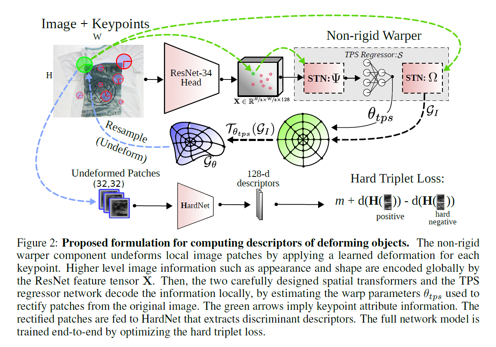

[](LICENSE)

# DEAL - Deformation-Aware Local Features
## <b>Extracting Deformation-Aware Local Features by Learning to Deform</b> <br>[[Project Page]](https://www.verlab.dcc.ufmg.br/descriptors/neurips2021/) [[Paper (Coming soon)]]() [[Container (Coming soon)]]()



This repository contains the original implementation of the descriptor "<b>Extracting Deformation-Aware Local Features byLearning to Deform</b>", to be presented at NeurIPS 2021. 


If you find this code useful for your research, please cite the paper:
```

```

## I - Ready to Use Container

`Coming soon...` 

## II - Colab Notebook 

`Coming soon...` 


## III - Local Installation Alternative

```
conda create env -f ./environment.yml
conda activate nrlfeat
```

- Testing

```bash
python example.py
```


**VeRLab:** Laboratory of Computer Vison and Robotics https://www.verlab.dcc.ufmg.br
<br>


<br/>