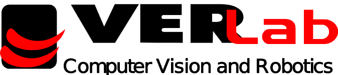

[](LICENSE)
[](https://colab.research.google.com/github/verlab/DEAL_NeurIPS_2021/blob/main/notebook/DEAL.ipynb)

# DEAL - Deformation-Aware Local Features
## <b>Extracting Deformation-Aware Local Features by Learning to Deform</b> <br>[[Project Page]](https://www.verlab.dcc.ufmg.br/descriptors/neurips2021/) [[Paper (Coming soon)]]() [[Container (Coming soon)]]() 


This repository contains the original implementation of the descriptor "<b>Extracting Deformation-Aware Local Features byLearning to Deform</b>", to be presented at NeurIPS 2021. 


If you find this code useful for your research, please cite the paper:

```
Citation coming soon...
```

## I - Colab Notebooks

- Simple Usage: [](https://colab.research.google.com/github/verlab/DEAL_NeurIPS_2021/blob/main/notebook/DEAL.ipynb)
- With Visualizations: [](https://colab.research.google.com/github/verlab/DEAL_NeurIPS_2021/blob/main/notebook/DEAL_visualization.ipynb)

## II - Ready to Use Container

`Coming soon...` 

## III - Local Installation Alternative

To use conda, run:

```bash
conda env create --file ./environment.yml
conda activate deal
```

If you want to install all the packeges yourself, here's the ones we used:

```
cv2: 4.5.1
torch: 1.6.0
numpy: 1.19.2
matplotlib: 3.3.4
scipy: 1.7.2
tqdm: 4.59.0
kornia: 0.4.1
h5py: 3.2.1
torchvision: 0.7.0
```

Now test the installation runing a simple example!

```bash
python example.py
```

## IV - Training the model

The file [run.py](run.py) contains the training code to our model and some optios for ablation studies.
To train the model you will need to download our preprocessed dataset at [nonrigid-data (88GB)](). Save the dataset in the folder `data`, at the root of this repository.


To train the model we used the command:
```
python run.py --mode train --datapath data/train-big.h5 --dataset nonrigid
```

The training process consumes about 11GB of memory of the GPU. On a GTX1080Ti it took about 6 hours to complete the training.

## V - Evaluation

For the evaluation you will need to download the TPS ground truth files. It contains a dense correspondence  between the masters images and the rest of the sequences.

To evaluate our method first calculate the distance matrix between pairs of images of the dataset.

```
python evaluation/benchmark.py --input <DATASET_ROOT> -d --output ./results --sift --tps_path <PATH_TO_TPS_FOLDER_ROOT> --model models/newdata-DEAL-big.pth
```

Now compile the results 

```
python evaluation/plotPR.py --input results/<DATASET_NAME> -d --tps_path <PATH_TO_TPS_FOLDER_ROOT> --metric <MMS/MS> --mode erase
```

## VI - Datasets

All available datasets are listed on [https://verlab.dcc.ufmg.br/descriptors/neurips2021](https://verlab.dcc.ufmg.br/descriptors/neurips2021)

**VeRLab:** Laboratory of Computer Vison and Robotics https://www.verlab.dcc.ufmg.br
<br>


<br/>
